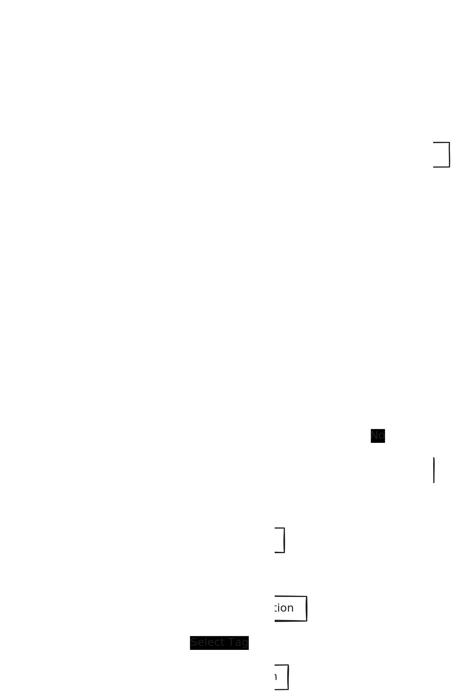

# Deployment

We are using conventional commits and semantic versioning for the project. The deployment process is as follows:

- When a pull request is merged into `main` triggers a preview deployment in Vercel and a new pull request created by [`release-please`](https://github.com/googleapis/release-please-action/tree/v4/) GitHub Action with the changes documented in the [`CHANGELOG.md`](./CHANGELOG.md) file
- When the pull request with the changes in the `CHANGELOG.md` file is merged into `main` and has breaking changes, it triggers a version bump as a git tag.
- Then, we can manually deploy the new version to production by using the GitHub Action [`deploy-website-production`](./.github/workflows/deploy-website-production.yml) and selecting the tag to deploy.

