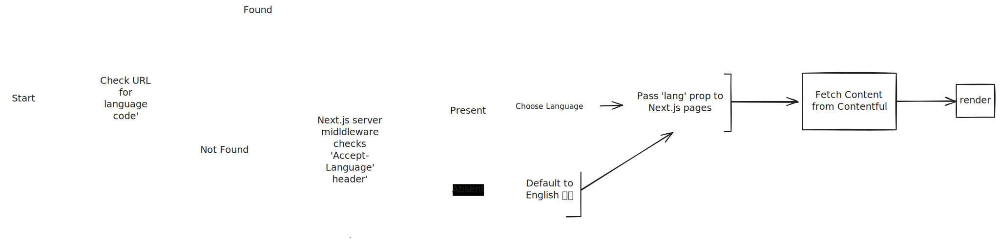

# Internasionalisation and localisation

The content of this website is available in multiple languages. The language of the URL determines the language of the content. For example, the URL `https://www.example.com/en/docs/development/i18n` will display the content in English, while the URL `https://www.example.com/fr/docs/development/i18n` will display the content in French.

We first know which language to display by looking at the `Accept-Language` header in the request using [Next.js middleware](https://nextjs.org/docs/app/building-your-application/routing/middleware). If the header is not present, we will default to English.
Once we knew which language to display, we passed language code (`lang`) as a prop for every page. This prop is then used in Contentful GraphQL queries to fetch the correct content.

